On a machine with four AMD Opteron 6276 (2.3 GHz, 16 cores, 16M L2/16M L3 Cache), giving a total of 64 cores and 128 GB or RAM, running Linux 3.2.0-amd64.

<ul id="bulldozer-results">
	<li>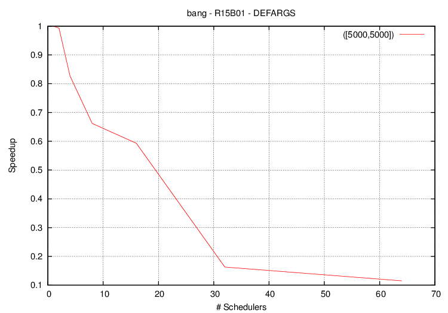</li>
	<li>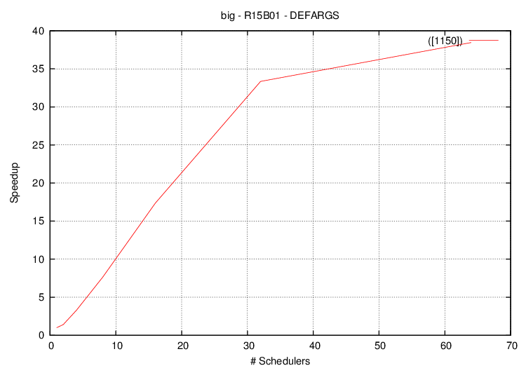</li>
    <li>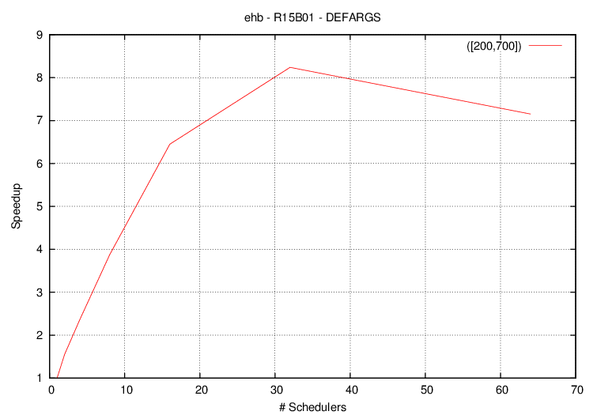</li>
    <li>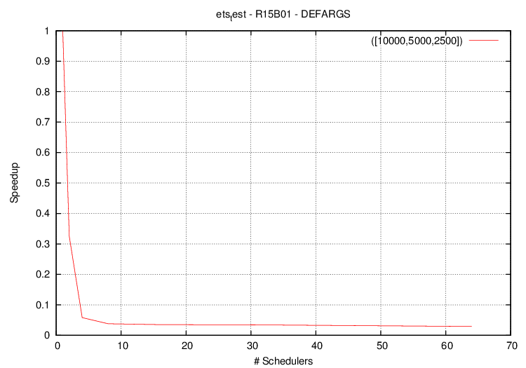</li>
    <li>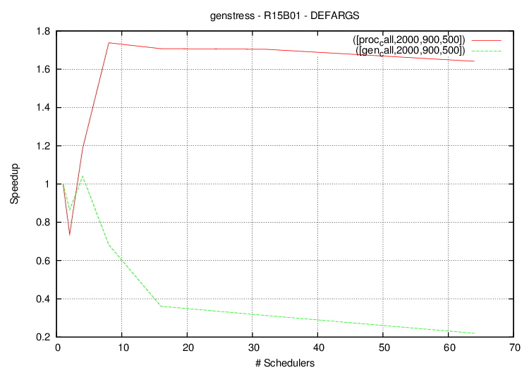</li>
    <li>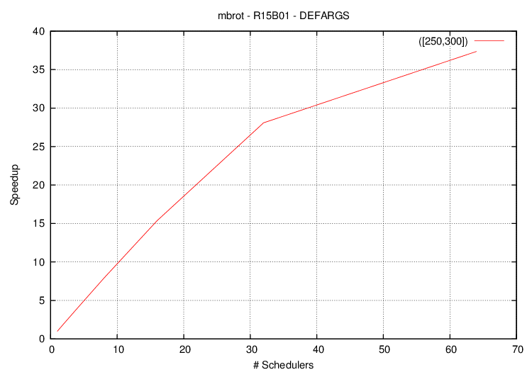</li>
    <li>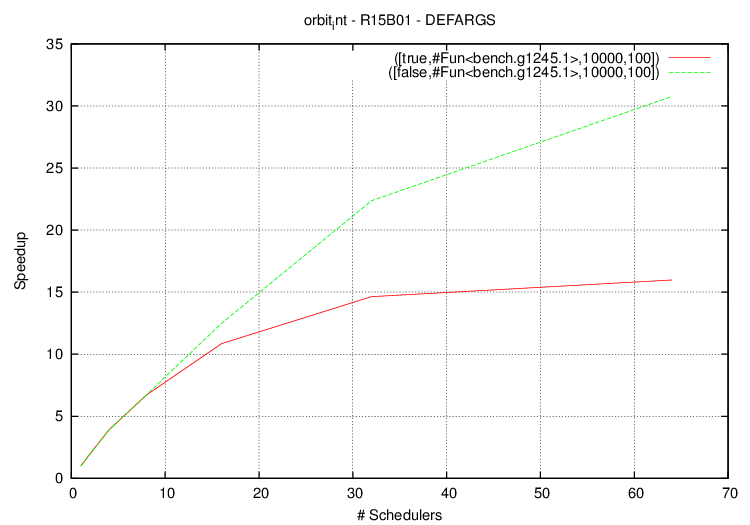</li>
    <li>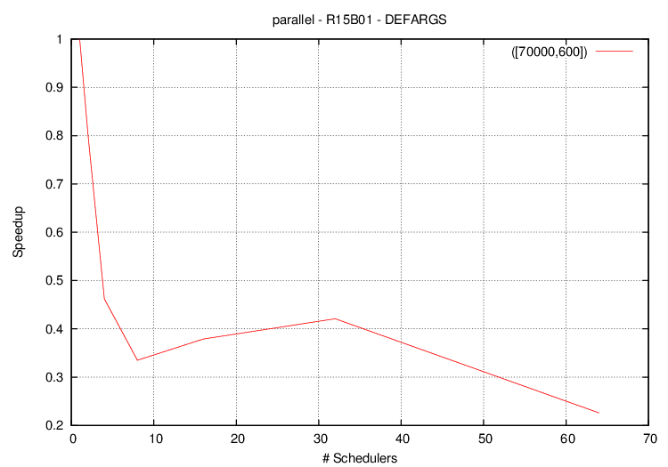</li>
    <li>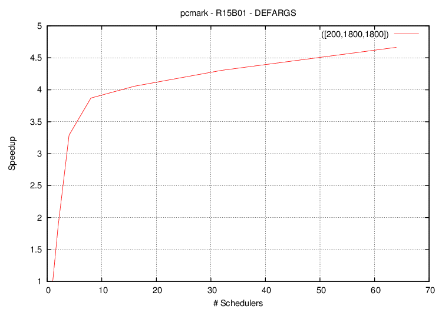</li>
    <li>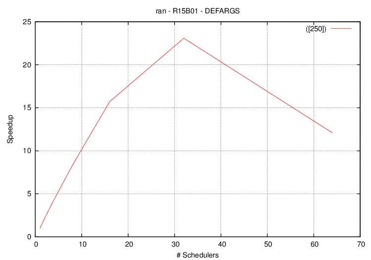</li>
    <li>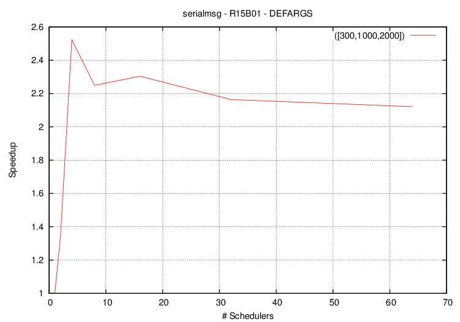</li>
    <li>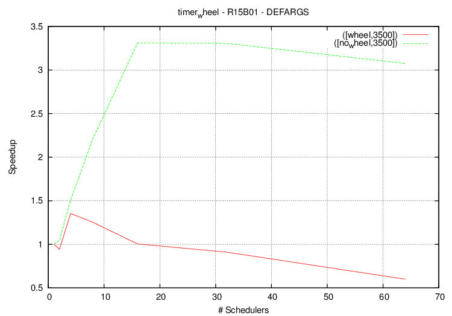</li>
</ul>

